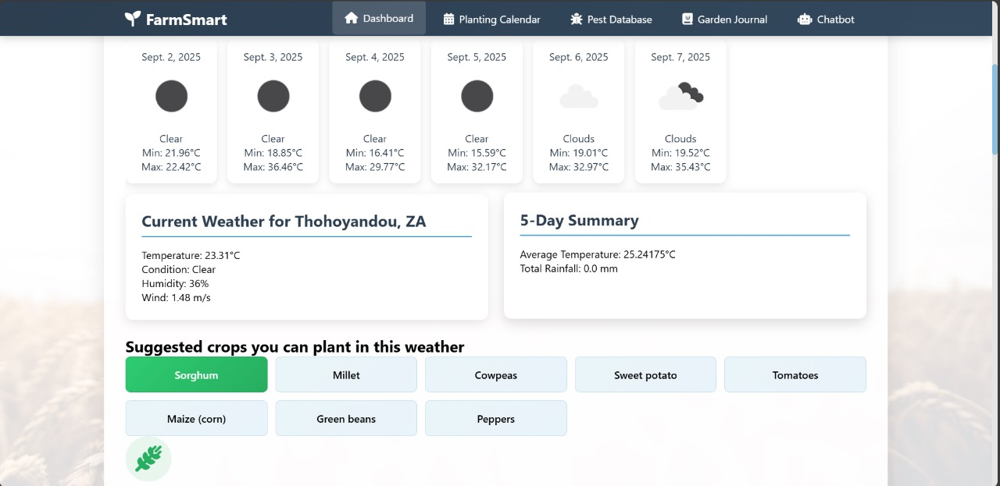
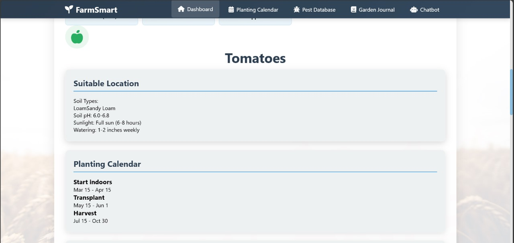

# Smart Weather Advisory System

## Problem Statement  
Agriculture in South Africa is highly vulnerable to climate change. Farmers face unpredictable weather patterns such as sudden rainfall, droughts, frost, and heatwaves, which directly affect crop yields and income. Without localized and timely weather information, they risk planting unsuitable crops, wasting resources, and suffering economic losses.

###  Our Solution  
We developed a **Smart Weather Advisory System**, a web-based agricultural decision-support platform that empowers farmers with:  
-  **Real-time weather forecasts** (via OpenWeatherMap API)  
-  **Crop recommendations** (based on soil, weather, and region)  
-  **Smart planting calendars**  
-  **Pest & disease database** with prevention strategies  
-  **AI-powered chatbot** for instant farming guidance  
-  **Garden Journal** for tracking farm activities  

---

##  System Design  
Our system follows a **3-Tier Architecture**:  

- **Client Tier**: Web browser (HTML, CSS, JS, Bootstrap, Chart.js)  
- **Application Tier**: Django Web Server with services for authentication, weather, crop recommendation, pest database, chatbot integration, and APIs  
- **Data Tier**: SQLite Database + External APIs (OpenWeatherMap, LANDBOT)  

### 🔗 API Endpoints  
- `/api/weather/<location>/` → Fetch weather data  
- `/api/crop/recommend/` → Get crop recommendations  
- `/api/pests/<crop>/` → Pest information  
- `/api/chatbot/query/` → Chatbot queries  
- `/api/journal/entries/` → Retrieve journal entries  

---

## Features & Demo  

### GUI Pages  
- **Home Page** → Overview + Mission  
- **Selection Page** → User inputs preferences  
- **Weather Dashboard** → 7-day trends, temperature, pest analysis  
- **Smart Planting Calendar** → Suggests optimal planting times  
- **Pest Database** → Info on pests & prevention  
- **Garden Journal** → Record activities & photos  
- **AI Chatbot** → Farmwise Assistant for guidance  

###Example Visualizations  
- Temperature trend line chart  
- Pest distribution pie chart  
- Unit test performance bar chart  

---

## Setup & Tools  
**Backend**: Python (3.10+), Django (4.2+), Django REST Framework  
**Frontend**: HTML5, CSS3, JavaScript (ES6+), Bootstrap, Chart.js  
**Database**: SQLite (default for dev)  
**APIs**: OpenWeatherMap, LANDBOT  
**Dev Tools**: VS Code, Git, GitHub  

### Installation 
 **For implementation Check Final Commit
```bash
# Clone repo
git clone https://github.com/your-username/SmartWeatherAdvisorySystem.git
cd SmartWeatherAdvisorySystem

# Create virtual environment
python -m venv venv
source venv/bin/activate   # On Windows: venv\Scripts\activate

# Install dependencies
pip install -r requirements.txt

# Run server
python manage.py runserver
```

---

## Team Members  
- Nkoana Hope Lerato – 202204804  
- Mawela Mpho Precious – 202233722  
- Khalo Ayanda Girly – 202213324  
- Dlamini Kelebogile Sylvia – 202224253  

---
##References  
- Olabanji, Ndarana & Davis (2021) – *Impact of Climate Change on Crop Production in South Africa*  
- Kephe, Ayisi & Petja (2021) – *Challenges & Opportunities in Crop Simulation Modelling*  
- FAO (2019) – *Climate-Smart Agriculture Sourcebook*

 ## Graphical User Interface (GUI)

Our system includes multiple interactive pages designed for farmers.  

### 1. **Home Page**  
- Overview of the system (mission, weather forecasts, crop-specific guidance, early alerts).  
- Scrollable layout for easy navigation.  

`

---

### 2. **Selection Page**  
- Allows farmers to select preferences using checkboxes.  
- Helps tailor recommendations.  
  

---

### 3. **Weather Analysis Dashboard**  
- Displays real-time weather data.  
- Includes:  
  - Temperature Trend Line Chart  
  - Unit Test Performance Bar Chart  
  - Pest Distribution Pie Chart  
  - Insights Panel (color-coded alerts & advice)  


---

### 4. **Sign Up Page**  
- New users can register with:  
  - Full Name  
  - Email Address  
  - Password + Confirmation  
- Validates inputs (unique email, strong password).  
- Stores user details securely in the database.  
- May send confirmation email.  
 

---

### 5. **Login Page**  
- Registered users log in with:  
  - Email Address  
  - Password  
- Verifies credentials against the database.  
- Grants access to features (weather dashboard, journal, chatbot, etc.).  
- Displays error + reset option if credentials are wrong.  
  

---

### 6. Farm Weather Dashboard  

The **Farm Weather Dashboard** allows users to access personalized, weather-based crop recommendations. Farmers can either:  
- Manually enter their farm location, or  
- Use the **“Use My Current Location”** button for automatic detection.  

#### Once the location is set:  
1. The dashboard displays the **daily weather forecast for the next six days**.  
2. The system suggests **crops that grow best under the predicted weather conditions**.  
3. When a user selects a crop of interest:  
   -  The **soil type** for their location is displayed.  
   -  **Soil pH** and recommended **watering methods** are provided.  
   -  A **growth timeline** is shown, from seed germination → sprouting → vegetative → flowering → fruiting → harvest.  
   -  Farming **tips and best practices** are provided for successful crop growth.  

#### Purpose  
The Farm Weather Dashboard enables farmers to make **informed decisions** about:  
- Crop selection  
- Planting schedules  
- Crop care  

This helps maximize yield and reduce losses caused by climate variability.  






### 6. **Smart Planting Calendar**  
- Suggests optimal planting & harvesting times.  
- Highlights favorable days based on climate.
- The Smart Planting Calendar helps farmers plan their sowing and harvesting activities based on local weather conditions. Users can select a specific month, and the calendar displays all the days within that month.
Once a month is selected:
1.The system highlights which days are optimal for planting specific crops.
2.It provides information on expected temperature conditions, such as days with mild temperatures suitable for planting.
3.Users can use this guidance to schedule planting activities to maximize crop growth and minimize risks associated with adverse weather. 


---

### 5. **Pest & Disease Database**  
- Search pests and diseases affecting specific crops.  
- Shows prevention and treatment methods.  


 

---

### 6. **Garden Journal**  
- Record farming activities.  
- Upload photos & share entries with community.  


---

### 7. **AI Chatbot (Farmwise Assistant)**  
- Provides instant farming advice.  
- Personalized responses using real-time data.  


  

---

